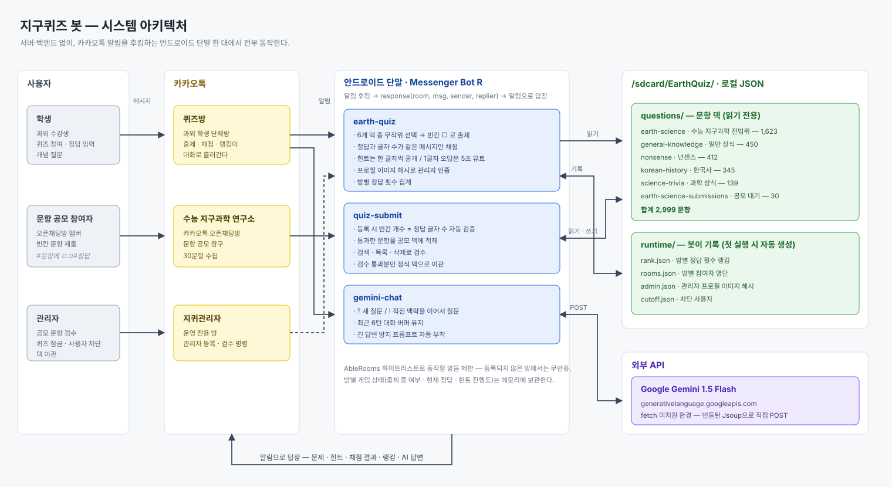

# 지구퀴즈 봇 (Earth Quiz Bot)

지구과학 과외 학생들이 **전범위 복습을 꾸준히** 하게 만들기 위해, 이미 하루 종일 켜져 있는 앱 — 카카오톡 — 안으로 퀴즈를 가져온 프로젝트입니다. 직접 구축한 약 3,000문항의 빈칸 퀴즈 DB, 오픈채팅방 문항 공모 파이프라인, 방을 나가지 않고 바로 질문할 수 있는 Gemini 연동을 안드로이드 단말 하나 위에서 돌렸습니다.

`2024` · `JavaScript (Rhino / ES5+)` · `Messenger Bot R` · `Google Gemini API`

<details>
<summary><b>🇬🇧 English summary</b></summary>

<br>

A KakaoTalk chatbot built in 2024 to keep my earth-science tutoring students reviewing the whole syllabus, not just the current chapter.

Revision homework was consistently ignored — not for lack of ability, but because anything requiring a separate app or site simply did not get done. So the quiz moved to where the students already were. It runs on `Messenger Bot R`, an Android runtime that hooks KakaoTalk notifications and replies through them: no server, no signup, no install for the students. A spare phone was the entire infrastructure.

- **Fill-in-the-blank quiz** — `^` in a question expands into `□` boxes matching the answer length, so the blank itself is a hint. Only messages whose length matches the answer are graded, which keeps ordinary chatter from being mistaken for a guess.
- **Progressive hints** — each request reveals one more random character; when all are exposed the bot concedes and moves on.
- **Per-room leaderboards**, persisted to disk.
- **Crowdsourced questions** — members of the open chat room "수능 지구과학 연구소" submitted items as `#sentence with ㅁㅁ#answer`. The bot checks that the blank count matches the answer length, files it into a review deck, and provides search / list / delete tooling to promote entries into the main deck.
- **In-chat LLM** — `?` asks Gemini 1.5 Flash a new question, `!` continues with accumulated context, so a stuck student never leaves the room.
- **Ops guards** — room whitelisting, admin auth via a hash of the sender's profile image, game lock, user blocking, and a 5-second mute for single-character spam answers.

**Question bank** — 2,999 items across six decks: earth science (1,623, hand-built), general knowledge (450), nonsense riddles (412), Korean history (345), science trivia (139), community submissions (30).

</details>

## 어떻게 돌아가나



Messenger Bot R은 서버가 아니라 **카카오톡 알림을 가로채 답장하는 방식**이라 별도 백엔드가 필요 없습니다. 대신 `fetch`가 없어 네트워크 호출은 번들된 Jsoup으로 직접 POST해야 하고, 상태는 전부 로컬 JSON 파일에 직렬화해야 합니다. 그 제약이 설계의 대부분을 결정했습니다.

## 명령어

| 명령 | 동작 |
|---|---|
| `ㅈㅋ` | 문제 출제 (6개 덱 중 무작위) |
| `ㅈㅋㅎㅌ` | 힌트 — 정답의 한 글자를 무작위로 공개 |
| `ㅈㅋㅈㄷ` | 정답 공개 |
| `ㅈㅋㅇㅇ` / `ㅈㅋㄴㄴ` | 자동 연속 출제 켜기 / 끄기 |
| `ㅈㅋㄹㅋ` | 방별 정답 횟수 랭킹 |
| `ㅈㅋㅁㅊ` / `ㅈㅋㄱㄱ` | 퀴즈 잠금 / 해제 *(관리자)* |
| `차단 이름` | 채점 대상에서 제외 *(관리자)* |
| `#문장에 ㅁㅁㅁ#정답` | 공모 덱에 등록 (`ㅁ` 개수 = 정답 글자 수) |
| `#검색#` · `#목록#` · `#삭제#N` | 공모 덱 조회 / 삭제 (`%…%` 는 정식 덱 대상) |
| `? 질문` / `! 이어서 질문` | Gemini 질의응답 |

정답은 명령이 아니라 그냥 채팅으로 입력합니다.

## 문항 DB

지구과학 문항은 수능·모의고사 범위를 직접 빈칸 문제로 재가공해 쌓았고, 카카오톡 오픈채팅방 **"수능 지구과학 연구소"** 에서 공모를 받아 검수 후 편입했습니다.

| 덱 | 주제 | 문항 수 |
|---|---|---:|
| `earth-science` | 수능 지구과학 전범위 | 1,623 |
| `general-knowledge` | 일반 상식 | 450 |
| `nonsense` | 넌센스 | 412 |
| `korean-history` | 한국사 | 345 |
| `science-trivia` | 과학 상식 | 139 |
| `earth-science-submissions` | 공모 (검수 대기) | 30 |
| | **합계** | **2,999** |

`^` 하나가 빈칸이고, 봇이 정답 글자 수만큼 `□`로 펼칩니다.

```json
{"Question": "^에 최초의 척추동물이 출현하였다.", "Enser": "오르도비스기", "Number": 1}
```

```
🌎 [□□□□□□]에 최초의 척추동물이 출현하였다.
```

## 설계에서 신경 쓴 부분

**빈칸이 곧 힌트다.** 정답 글자 수만큼 `□`를 펼친 건 장식이 아니라, "아예 모르겠다"와 "떠오를 것 같다" 사이를 좁히기 위한 장치였습니다. 글자 수를 아는 순간 학생들은 포기하는 대신 추측을 시작했습니다.

**채점 대상을 길이로 거른다.** 단체방은 잡담이 섞입니다. 모든 메시지를 채점하면 대화가 전부 "땡!"으로 도배되므로, **정답과 글자 수가 같은 메시지만** 채점합니다. 규칙 하나로 잡담과 답안이 분리됩니다. 이 필터를 넣자 한 글자 정답 문제에서 무차별 찍기가 나와, 1글자 오답자는 5초간 채점에서 제외했습니다.

**관리자 인증을 프로필 이미지 해시로.** 카카오톡 닉네임은 누구나 바꿀 수 있어 이름만으로는 신원이 되지 않습니다. 봇이 넘겨받는 프로필 이미지의 해시를 등록해 두고 대조하는 방식으로, 별도 인증 체계 없이 사칭을 막았습니다.

**공모를 2단계 파이프라인으로.** 받은 문항을 바로 정식 덱에 넣으면 품질 관리가 안 됩니다. 공모는 별도 덱에 쌓이고 등록 시점에 빈칸 개수와 정답 길이가 일치하는지 자동 검증하며, 검색·목록·삭제로 검수한 뒤 정식 덱으로 옮깁니다.

## 배포

1. **Messenger Bot R** 설치 후 알림 접근·저장소 권한과 배터리 최적화 예외를 허용합니다.
2. `bots/*` → `/sdcard/Bots/*`, `data/questions/` → `/sdcard/EarthQuiz/questions/` 로 복사합니다. 각 폴더 `bot.json` 의 `main` 값이 스크립트 파일명과 일치해야 앱이 인식합니다.
3. `bots/gemini-chat/gemini-chat.js` 의 `GEMINI_API_KEY` 를 [Google AI Studio](https://aistudio.google.com/app/apikey)에서 발급받은 키로 교체합니다.
4. 각 스크립트 상단 `AbleRooms` 배열에 봇을 돌릴 **카카오톡 방 이름을 정확히**(이모지·공백 포함) 넣습니다. 여기 없는 방에서는 아무 반응도 하지 않습니다.
5. 관리자 명령을 쓰려면 `지퀴관리자` 방에서 `등록` 을 보내 프로필 이미지 해시를 등록합니다.

`/sdcard/EarthQuiz/runtime/` 의 랭킹·방 명단은 첫 실행 때 자동 생성됩니다.

## 한계

알림 후킹 방식이라 폰이 꺼지거나 카톡이 백그라운드에서 정리되면 봇도 멈춥니다. 게임 상태를 전역 객체에 들고 있어 앱을 재시작하면 진행 중이던 문제가 사라지고, 채점이 글자 수에 묶여 있어 유의어나 띄어쓰기 변형 정답은 받아 주지 못합니다. 오답 이력을 남겨 간격 반복(spaced repetition)으로 확장하는 게 다음 단계였습니다.
